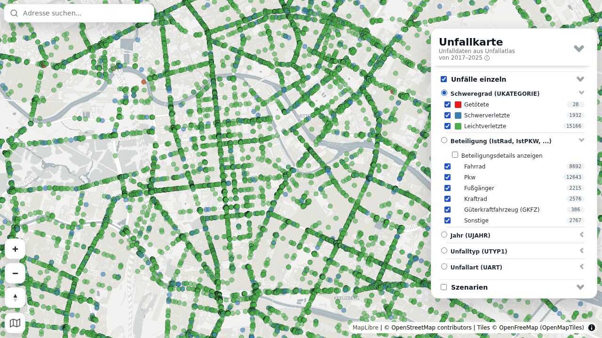

# 🚧 Unfallkarte (Deutschland)

**Interaktive Webkarte für Verkehrsunfälle in Deutschland.** Über 2,2 Millionen polizeilich
erfasste Unfälle mit Personenschaden aus den Jahren **2017–2025** — filterbar nach Schwere,
Unfallart, Unfalltyp, Jahr und Beteiligung, und kombinierbar mit Kontextdaten: Schulen,
Tempolimits, Verkehrsmengen, Lärm, Radinfrastruktur.

Darüber hinaus rechnet die Pipeline **Szenarien**: Fragen an die Daten, die man auf der
Karte sonst nur ahnen kann — wo häufen sich Unfälle im Schulumfeld, wo unterbricht ein
kurzes Tempo-50-Stück eine sonst durchgängige 30er-Zone, wo liegen Unfallhäufungen nach
den Kriterien der Unfallkommissionen.

Quelle der Unfalldaten ist der [Unfallatlas der Statistischen Ämter](https://unfallatlas.statistikportal.de/)
(dl-de/by-2-0). Rohdaten und OpenStreetMap werden zu **PMTiles** verarbeitet und in einer
MapLibre-Karte gezeigt — ausschließlich über offene, frei gehostete Dienste, ohne
kommerzielle Karten-API und ohne API-Key.

## 🚀 Online ansehen

👉 **[vizsim.de/unfallkarte](https://vizsim.de/unfallkarte/)**



## 🏗️ Architektur

Zwei Teile in einem Repo:

- **`pipeline/`** — Python-Pipeline (uv): lädt Unfalldaten (2017–2025) und OSM, baut
  PMTiles, rechnet die Szenarien, deployt nach Backblaze B2.
  Details und CLI: [`pipeline/README.md`](pipeline/README.md).
- **Frontend (Repo-Root)** — MapLibre-Karte (`index.html`, `main.js`, `js/`), gebaut mit
  **Vite** nach `dist/`. Die PMTiles kommen **local-first** aus `data/`, sonst per
  **B2-Fallback**; gesteuert über ein generiertes `manifest.json`.

Jede Zeile der Legende entspricht genau einem Eintrag in der **Layer-Registry**
(`js/layers/`): Quelle, Layer-Definitionen, Popup, Permalink-Zeichen und Legendentext
stehen dort an einer Stelle statt über acht Dateien verteilt.

## 🗂️ Daten & Ebenen

- **Unfälle 2017–2025** (Unfallatlas) — Einzelpunkte ab Zoom 11, darunter Cluster mit
  Tortendiagrammen nach Schweregrad.
- **OSM-Kontext** (ODbL) — Schulen und Kindergärten, Gesundheitseinrichtungen,
  Spielplätze, Querungen und Übergänge, ÖPNV-Haltestellen, Tempolimit-Straßennetz.
- **Bevölkerung** — Zensus 2022 (Destatis) im 100-m-Gitter, in der Übersicht im 1-km-Gitter:
  Einwohner, unter 18, ab 65, Durchschnittsalter.
- **Verkehr & Umwelt** — Verkehrsmengen (SVZ der Länder, BASt-Bundesfernstraßen,
  UBA-Hauptverkehrsstraßen), Rad-Geschwindigkeiten (movebis/Stadtradeln), Überholabstände
  ([OpenBikeSensor](https://www.openbikesensor.org/)), Umgebungslärm (UBA, Tag und Nacht),
  [Telraam](https://telraam.net/)-Zählstellen, Pkw-Geschwindigkeiten Berlin
  (Uber Movement 2019, statisch).
- **Live-Layer** (direkt von fremden Servern, nicht aus der Pipeline) — Radinfrastruktur
  ([radinfra.de/TILDA](https://radinfra.de/)) und Mapillary für den Street-View-Sprung.

### Szenarien

Jedes Szenario verschneidet die Unfall- oder OSM-Daten mit einer Kontextebene. Die
Schwellenwerte lassen sich in der Legende per Regler verändern.

| | Was es zeigt |
|---|---|
| **sc1** | Unfall-Cluster auf Tempo-100-Straßen (DBSCAN, eps 50 m, min. 3 Unfälle) |
| **sc2** | Unfälle im Schulumfeld (50 m Umkreis, Rad- und Fußunfälle ab 2020) |
| **sc3** | Lücken in Tempo 30: kurze 50er-Abschnitte (< 400 m) zwischen 30er-Zonen |
| **sc6** | Tempo 50 direkt vor Schulen (30 m Umkreis, ab 60 m Länge) |
| **sc8** | Straßenlärm an Schulen (UBA-Lärmkartierung, L<sub>den</sub> > 56 dB) |
| **sc9** | Unfallhäufungen nach M-Uko-Kriterien (vereinfacht: 3-Jahres-Fenster + DBSCAN) |

> **Hinweis:** sc9 bildet die Kriterien der Unfallkommissionen nach, ersetzt aber keine
> amtliche Feststellung — ob eine Stelle ein Unfallschwerpunkt ist, entscheidet die
> zuständige Unfallkommission.

## 🌐 Offene Dienste — ohne Registrierung, ohne API-Key

- **Basemap** — [OpenFreeMap](https://openfreemap.org/) Positron (inkl. Fonts), dazu
  OSM Carto und Esri Imagery, umschaltbar im Karten-Panel unten links.
- **Relief, Hillshade und 3D-Gelände** — [Mapterhorn](https://mapterhorn.com/)
  (raster-dem, terrarium). **3D-Gebäude** — OpenFreeMap-Planet.
- **Adress-Suche** — [Photon](https://photon.komoot.io/) (Komoot).

Einzige Ausnahme: der optionale Mapillary-Layer braucht einen Mapillary-**Client-Token**
(`.env.production`, öffentlich by design — er steht ohnehin im ausgelieferten JS).
Pipeline-Secrets wie die B2-Keys liegen ausschließlich in `pipeline/.env` (gitignored).

## 🖥️ Frontend lokal starten

```bash
npm install          # einmalig: Vite, Playwright und die Karten-Libs
npm run dev          # Dev-Server mit Hot-Reload -> http://localhost:5173
npm run build        # Produktions-Build nach dist/
npm run preview      # dist/ ausliefern -> http://127.0.0.1:4173
```

Ungebaut läuft das Repo-Root nicht mehr (die Module importieren `maplibre-gl` und `pmtiles`
aus npm) — immer über `npm run dev` bzw. den Build.

Deinen lokalen Mapillary-Token legst du in `.env.development.local` ab
(`VITE_MAPILLARY_TOKEN=…`, gitignored); ohne ihn bleibt nur der Mapillary-Layer leer. Der
Build nimmt den öffentlichen Token aus `.env.production`.

**Local-first:** liegt ein `data/`-Verzeichnis vor (typischerweise ein Symlink auf
`pipeline/data/`), kommen die PMTiles von dort — sonst automatisch aus dem B2-Bucket. Du
brauchst also keine lokalen Daten, um am Frontend zu arbeiten. Dev-Server und Preview
liefern `data/` mit Range-Requests aus (Middleware in `vite.config.js`); ins `dist/` kommt es
nie.

### Libs (maplibre-gl, pmtiles, chart.js)

Exakt gepinnt in `package.json`. Upgrade = `npm i -E maplibre-gl@x.y.z`, danach **immer**
`npm run test:web` — die letzten beiden MapLibre-Upgrades haben den Cluster-Hover still
gebrochen, gefangen hat es jeweils nur der Smoke-Test.

**MapLibre wird nicht gebündelt.** Es sucht seinen Worker zur Laufzeit neben der eigenen
Datei; gebündelt fände es ihn nicht (die Karte bleibt ohne jeden Fehler leer). Der Build
kopiert darum die drei `.mjs` nach `dist/lib/maplibre-gl@<version>/` und löst den Import per
Importmap auf (`vite.config.js`). Alle Module importieren MapLibre über `js/lib/maplibre.js`.
pmtiles wird mitgebündelt, chart.js kommt als eigener Chunk erst beim ersten Uspeed-Chart.

## ✅ Tests

```bash
npm run test:unit                      # browserlos (node --test), Sekunden
npm run test:web                       # Frontend im Browser (Playwright, headless Chromium)
uv --directory pipeline run pytest     # Pipeline (Dry-Run, keine Daten nötig)
(cd pipeline && uvx ruff check)        # Lint
```

Die Browser-Tests in `tests/web/` fahren die echte Seite: Lädt die Karte ohne JS-Fehler?
Liefert der Cluster-Hover das vergrößerte Tortendiagramm? Erscheint bei überlappenden
Objekten genau **ein** gestapeltes Popup? Überlebt ein Permalink das Kopieren und
Neuladen samt Reglern? Sie bauen `dist/` und testen genau diesen Stand (`vite preview`),
nutzen Local-first/B2 wie im Betrieb und brauchen also keine lokalen Daten.

Zwei Tests sind das eigentliche Sicherheitsnetz für Umbauten:

- **`golden.spec.js`** hält Quellen, alle Layer-Definitionen und das Verhalten jedes
  Toggles über drei Zoomstufen als Snapshot fest. Nach einem Refactor muss er
  **unverändert** grün sein; gewollte Änderungen mit `--update-snapshots` aufnehmen und den
  Diff Zeile für Zeile prüfen.
- **`contract.spec.js`** liest die Metadaten der echten PMTiles und prüft jeden
  `source-layer` und jedes im Style benutzte Attribut. Nötig, weil MapLibre bei PMTiles
  **nicht** validiert — der Test fand auf Anhieb zwei Bugs, die monatelang unbemerkt waren.

Alles läuft in der CI (`.github/workflows/ci.yml`). **Vor jedem Lib-Upgrade laufen
lassen.**

## ⚙️ Daten aufbauen (Pipeline)

Ausführlich in [`pipeline/README.md`](pipeline/README.md). Kurzform:

```bash
cd pipeline
uv sync
uv run unfallkarte accidents fetch && uv run unfallkarte accidents build
uv run unfallkarte accidents tiles data/accidents/accidents_germany_2017-2025_oid.parquet
uv run unfallkarte osm fetch && uv run unfallkarte osm build all
uv run unfallkarte scenario run-all
uv run unfallkarte manifest && uv run unfallkarte deploy
```

Ein neues Unfalljahr ist ein YAML-Block in `pipeline/config/accidents.yaml` — kein
Code-Edit. Kontextlayer analog: `uv run unfallkarte <hvs|laerm|obs|telraam> fetch|build`
bzw. `movebis build` und `census build` (Zensus aus Archivkopien in `data/raw/census/`).

System-Binaries (nicht über pip): `tippecanoe` und `tile-join`, `osmium-tool`; die b2-CLI
über `uv tool install b2`. (`ogr2ogr`/gdal-bin wird **nicht** gebraucht — OSM-PBF liest
pyogrio direkt.)

## 🌿 Branches & Deploy

`main` ist Arbeits- **und** Deploy-Branch: nach jedem Push baut die CI `dist/`, testet
genau diesen Stand und veröffentlicht ihn auf GitHub Pages — nur wenn die Frontend-Tests
grün sind (ein paar Minuten nach dem Push). Größere Umbauten laufen über einen
`temp/*`-Branch und werden erst nach grünen Tests gemergt. Der Stand vor dem
Pipeline-Refactor hängt als Tag **`v2025`**, der letzte Stand vor Vite als Tag **`pre-vite`**.

Die PMTiles liegen **nicht** im Git (`data/` ist gitignored), sondern lokal und im
öffentlichen B2-Bucket. Ein Code-Deploy und ein Daten-Deploy
(`uv run unfallkarte deploy`) sind zwei getrennte Vorgänge.

## 📚 Weitere Doku

- [`docs/TODO.md`](docs/TODO.md) — **alle** offenen Punkte (UX, CI, Pipeline, Aufräumen).
- [`docs/REFACTORING_PLAN.md`](docs/REFACTORING_PLAN.md) — reine Historie: was beim Umbau von
  Notebooks zur Pipeline entschieden wurde und **warum** (CRS-Disziplin, Bucket-Struktur,
  Local-first, keyless Basemap, AGPL). Keine offenen Punkte mehr.
- [`CLAUDE.md`](CLAUDE.md) — Regeln und Konventionen für die Arbeit im Repo.

## 🧰 Tech

MapLibre GL JS · PMTiles · Vite · tippecanoe · osmium-tool · GeoPandas/pyogrio (Python-Pipeline
mit **uv**) · OpenFreeMap · Mapterhorn · Backblaze B2 · Photon · radinfra.de/TILDA.

## 📄 Lizenz

**AGPL-3.0-or-later** © vizsim. (Früher MIT — bereits unter MIT veröffentlichte Stände
bleiben MIT, künftige Versionen sind AGPL.) Der Quellcode-Link im UI erfüllt die
AGPL-§13-Pflicht bei Netzwerknutzung.

**Daten** behalten ihre eigenen Lizenzen und Attribution: Unfallatlas (dl-de/by-2-0),
OpenStreetMap (ODbL), Umweltbundesamt (Lärm, Verkehrsmengen), OpenFreeMap (ODbL),
Mapterhorn, Mapillary, radinfra.de/TILDA, Telraam (CC BY-NC).
